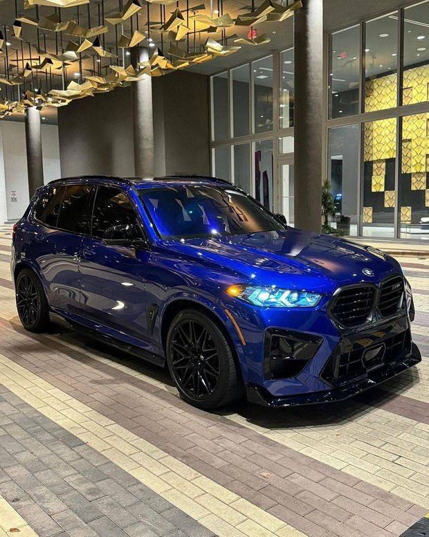

# Bambouk Motors — Site Vitrine

> **Votre partenaire de confiance pour une mobilité sans limites**

Site web statique vitrine pour **Bambouk Motors**, spécialiste de la vente, de l'importation et de la commercialisation de véhicules neufs et d'occasion au Sénégal.

---

## Structure du projet

```
bambouk-motors/
├── index.html                    ← Page d'accueil
├── pages/
│   ├── about.html                ← À propos
│   ├── services.html             ← Nos services
│   └── contact.html              ← Nous contacter
├── assets/
│   ├── css/
│   │   └── style.css             ← Styles globaux (dark/light mode, responsive)
│   ├── js/
│   │   └── main.js               ← JS : thème, hamburger, lightbox, animations
│   └── images/
│       ├── logo.jpeg             ← Logo de l'entreprise
│       └── gallery/              ← Photos des véhicules (voiture1.jpeg … voiture15.jpeg)
└── README.md                     ← Ce fichier
```

---

## Ouvrir le site en local

Aucune installation requise. Double-cliquez simplement sur `index.html` dans votre explorateur de fichiers. Le site s'ouvre directement dans votre navigateur (Chrome, Firefox, Edge, Safari).

> Les pages internes (`about.html`, `services.html`, `contact.html`) fonctionnent également en double-cliquant depuis le dossier `pages/`.

---

## Ajouter ou remplacer des photos

1. Placez vos nouvelles photos dans `assets/images/gallery/`
2. Nommez-les simplement : `voiture16.jpeg`, `voiture17.jpeg`, etc.
3. Dans `index.html`, ajoutez un bloc `.gallery-item` supplémentaire dans la section galerie :

```html
<div class="gallery-item" tabindex="0" role="button" aria-label="Agrandir photo véhicule 16">
  
  <div class="gallery-overlay" aria-hidden="true">
    <svg viewBox="0 0 24 24"><circle cx="11" cy="11" r="8"/><path d="m21 21-4.35-4.35"/></svg>
  </div>
</div>
```

Pour remplacer une photo existante, remplacez simplement le fichier dans `gallery/` **en conservant le même nom**.

---

## Modifier le numéro WhatsApp

Le numéro actuel est `+221 70 532 56 52` (lien : `https://wa.me/221705325652`).

Pour le changer, faites une recherche/remplacement dans tous les fichiers `.html` et `.js` :

- **Rechercher :** `221705325652`
- **Remplacer par :** votre nouveau numéro sans espaces ni `+` (ex : `221771234567`)

Fichiers concernés :
- `index.html`
- `pages/about.html`
- `pages/services.html`
- `pages/contact.html`
- `assets/js/main.js`

---

## Modifier l'adresse email

L'adresse actuelle est `Bamboukmotors@gmail.com`.

Recherchez `Bamboukmotors@gmail.com` dans tous les fichiers `.html` et remplacez par la nouvelle adresse.

---

## Modifier le lien Snapchat

Le lien actuel est `https://snapchat.com/t/otXM4saf`.

Recherchez `otXM4saf` dans tous les fichiers `.html` et remplacez par votre nouveau code de profil Snapchat.

---

## Changer la photo hero (accueil)

Dans `index.html`, repérez cette ligne dans la section `<header class="hero">` :

```html
<div class="hero-bg" style="background-image: url('assets/images/gallery/voiture6.jpeg');">
```

Remplacez `voiture6.jpeg` par le nom de la photo souhaitée.

---

## Activer / désactiver le dark mode par défaut

Dans chaque fichier `.html`, la balise `<html>` contient `data-theme="dark"`.
Pour démarrer en mode clair par défaut, changez en `data-theme="light"`.

Le choix de l'utilisateur est automatiquement sauvegardé via `localStorage`.

---

## Photos renommées

| Nom original | Nouveau nom |
|---|---|
| `WhatsApp Image 2026-06-18 at 6.36.35 PM.jpeg` | `voiture1.jpeg` |
| `WhatsApp Image 2026-06-18 at 6.36.36 PM (1).jpeg` | `voiture2.jpeg` |
| `WhatsApp Image 2026-06-18 at 6.36.36 PM (2).jpeg` | `voiture3.jpeg` |
| `WhatsApp Image 2026-06-18 at 6.36.36 PM.jpeg` | `voiture4.jpeg` |
| `WhatsApp Image 2026-06-18 at 6.44.03 PM (1).jpeg` | `voiture5.jpeg` |
| `WhatsApp Image 2026-06-18 at 6.44.03 PM.jpeg` | `voiture6.jpeg` ← **Hero accueil** |
| `WhatsApp Image 2026-06-18 at 6.44.04 PM (1).jpeg` | `voiture7.jpeg` |
| `WhatsApp Image 2026-06-18 at 6.44.04 PM (2).jpeg` | `voiture8.jpeg` ← À propos |
| `WhatsApp Image 2026-06-18 at 6.44.04 PM.jpeg` | `voiture9.jpeg` ← Services (importation) |
| `WhatsApp Image 2026-06-18 at 6.44.05 PM (1).jpeg` | `voiture10.jpeg` |
| `WhatsApp Image 2026-06-18 at 6.44.05 PM (2).jpeg` | `voiture11.jpeg` |
| `WhatsApp Image 2026-06-18 at 6.44.05 PM (3).jpeg` | `voiture12.jpeg` ← Services (entretien) |
| `WhatsApp Image 2026-06-18 at 6.44.05 PM (4).jpeg` | `voiture13.jpeg` |
| `WhatsApp Image 2026-06-18 at 6.44.05 PM.jpeg` | `voiture14.jpeg` ← Services (conseil) |
| `WhatsApp Image 2026-06-18 at 6.44.06 PM.jpeg` | `voiture15.jpeg` |

---

## Équipe

| Rôle | Nom | Contact |
|---|---|---|
| CEO | **Omar DIATA** | +221 70 532 56 52 |
| Product Owner | **Papa Malick NDIAYE** | [portfolio](https://pa-malick.github.io/portfolio/) |

---

## Technologies utilisées

- HTML5 sémantique
- CSS3 avec custom properties (variables CSS)
- JavaScript vanilla (ES6+)
- Google Fonts : Playfair Display + Inter
- Aucune dépendance npm, aucun bundler, aucun framework

---

*© 2026 Bambouk Motors. Tous droits réservés.*
